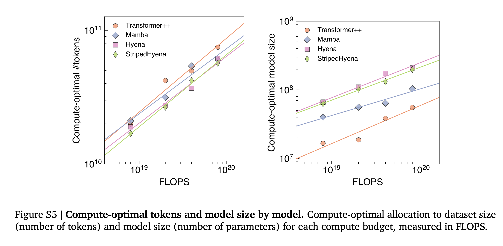
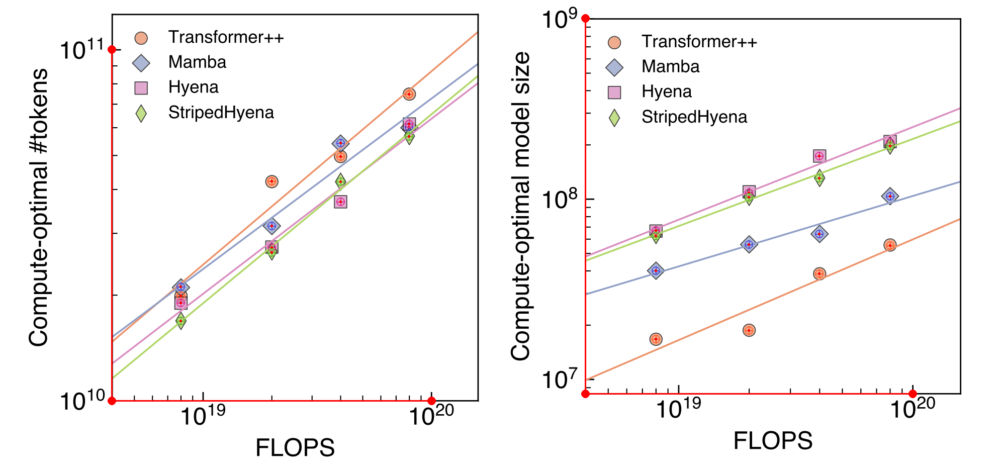
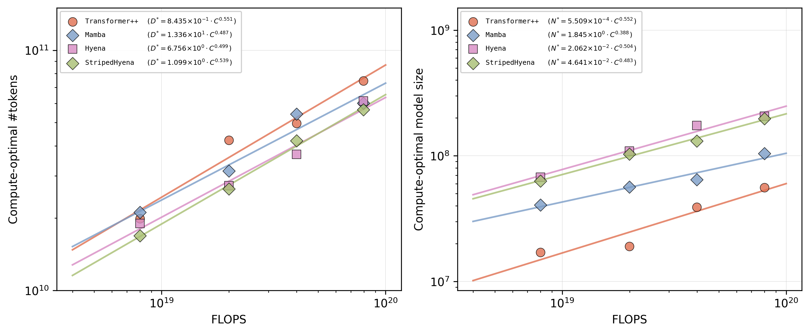

# Evo Scaling Law Extraction

Extracted compute-optimal scaling laws from **Figure S5** of [Sequence modeling and design from molecular to genome scale with Evo](https://www.biorxiv.org/content/10.1101/2024.02.27.582234v2) (Nguyen et al., 2024).

## Original Figure

Figure S5 from the paper — compute-optimal tokens and model size by model:



## Extraction Process

Data points were extracted by manually identifying pixel coordinates of each marker in the figure. The script maps pixel positions to data values using known axis bounds and log-scale interpolation.

The overlay below shows the extraction: red lines trace the axis spines, and colored crosshairs mark each extracted point. Crosshairs should sit centered on the original markers.



## Reproduction

Scaling laws were fit via linear regression in log-log space and plotted against the extracted data:



## Scaling Laws

Power-law fits of the form N* = a₀ &middot; C^a (model size) and D* = b₀ &middot; C^b (tokens), where C is the compute budget in FLOPS:

| Model | a | a₀ | b | b₀ |
|---|---|---|---|---|
| Transformer++ | 0.552 | 5.509 &times; 10⁻⁴ | 0.551 | 8.435 &times; 10⁻¹ |
| Mamba | 0.388 | 1.845 &times; 10⁰ | 0.487 | 1.336 &times; 10¹ |
| Hyena | 0.504 | 2.062 &times; 10⁻² | 0.499 | 6.756 &times; 10⁰ |
| StripedHyena | 0.483 | 4.641 &times; 10⁻² | 0.539 | 1.099 &times; 10⁰ |

Full extracted data: [evo_scaling_data.csv](outputs/evo_scaling_data.csv) | Scaling law coefficients: [evo_scaling_laws.csv](outputs/evo_scaling_laws.csv)

## Usage

```bash
uv run python main.py
```
